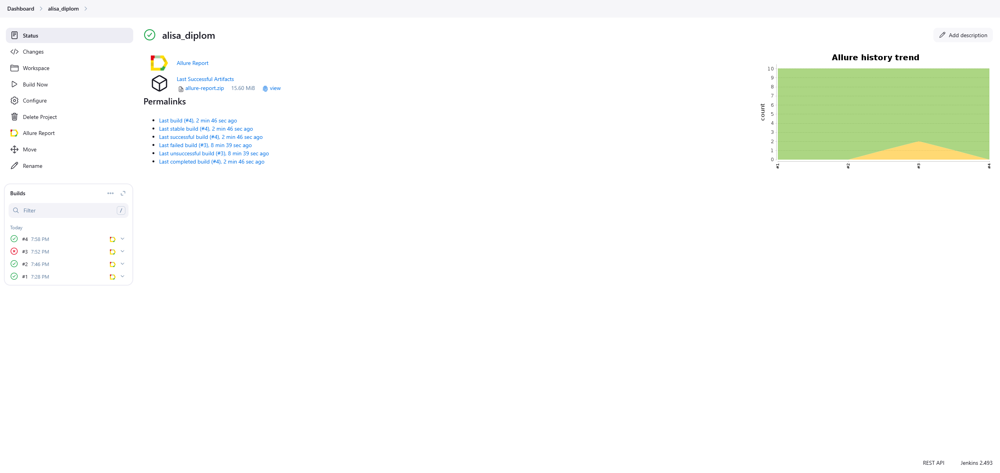

### Дипломный проект с автотестами Sela, LiveJournal, Gigachat API

### Используемые инструменты

| Python                                                            | Pycharm                                                            | GitHub                                                     | Selenium                                                     | Allure                                                     | Jenkins                                                     |                                                  
|:------------------------------------------------------------------|--------------------------------------------------------------------|------------------------------------------------------------|--------------------------------------------------------------|------------------------------------------------------------|-------------------------------------------------------------|
|  |  |   |  |  |  | 

### Автотесты

API:
* test_giga_api_models
* test_giga_api_text_generate
* test_giga_api_unauthorized

LiveJournal.UI:
* test_create_post
* test_update_post
* test_delete_post

Sela.UI:
* test_open_all_tabs
* test_open_babies_clothes
* test_open_favorites
* test_add_any_cloth_to_favorites

### Allure

Добавлен отчет о прохождении автотестов

К тестам приложены артефакты: screenshot, video, page source

### Jenkins

Для запуска автотестов в Jenkins была настроена конфигурация

Для запуска автотестов в Jenkins нужно нажать на Build Now

